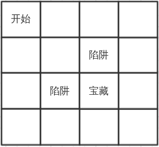

# 强化学习:走迷宫
## Background
一个基于强化学习的小demo,你只需要教会电脑走迷宫就可以了.
## Question
  
上面是这个迷宫的图,这是一个4*4的迷宫,起始点在(0,0),你要到达的地方是(2,2),这里藏着宝藏,而(2,1)和(1,2)是两个陷阱,掉进陷阱或者找到宝藏游戏结束,你需要让电脑找到一个策略,使用最短的路找到宝藏.environment相关的已经实现,具体的内容和使用方法可以查看 environment.py (不允许修改这个environme部分代码)
environment部分使用的example:
```
from environment import environment
env = environment()
start = env.start()
while True:
    # 拿到当前状态下的可能的行动
    available_action = env.get_action(state)
    # 使用你的策略选择行动
    action = your_algorithm(xxxxx)
    # 得到回报,新的状态,是否结束的标志
    next_state, reward, end = env.get_reward(state, action)
    # 判断是否结束
    if end == True:
        break
    # 切换到下一个状态
    state = next_state
```
## Hints:
强化学习有很多的专业术语需要了解:
 - state
 - action
 - environment
 - reward
 - agent  

推荐的算法: Q-learning, Sarsa, DQN等等  
不许直接按照自己找的路径hardcode,要求更换迷宫之后仍然可以work


